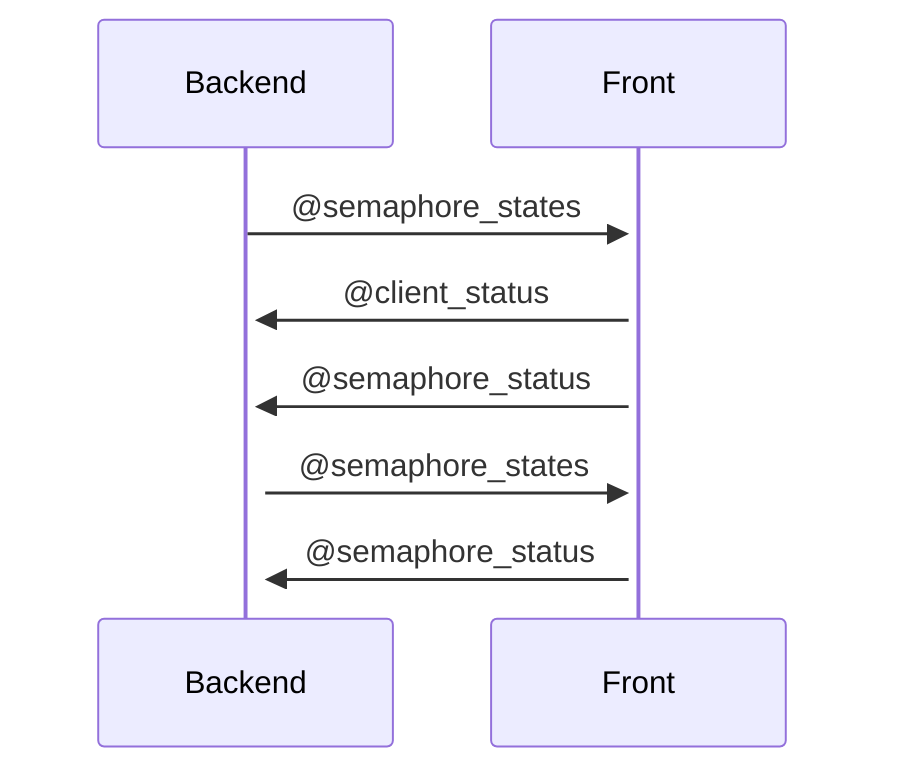
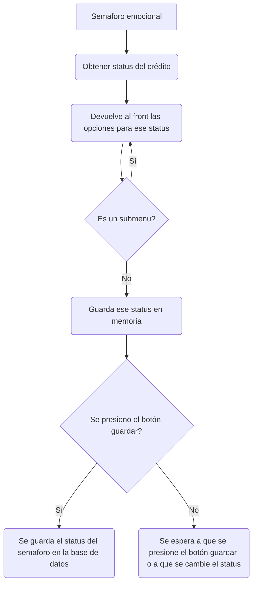

Created: 03-01-2023 21:38

##  **Idea** 
Es un menú que permite indicar información sobre el cliente, existen varios posibles atributos incluyendo sub menus que dependen del status, los valores aceptados son los siguientes:

> [!Diagrama de status]-
> ![[Pasted image 20230103220202.png]]

Para implementar la solución, al cargar la live view, desde el backed se detectará el status del crédito. 
Dependiendo del valor del status del crédito, se devolverá una lista con las posibles opciones a escoger, con base al diagrama de arriba.

El backend devolverá los posibles status en el socket bajo el nombre de `semaphore_states`.  Por otra parte el front, deberá guardar el valor seleccionado en la variable llamada `semaphore_status`.

En caso de que una de las opciones seleccionadas sea un sub menu, entonces al seleccionarlo el backend actualizara la lista de `semaphore_states` para dar los valores del sub menu.

Por otra parte, existirán dos botones, uno para guardar y otro para reiniciar el status.

La forma en la que interactuaran el front y el back será de la siguiente manera123:

La manera en la que se determinará el status del semaforo, será la siguiente:

##  **Tags**
 #visible  #abaco

##  **References**
 **West: similar** 
 **East: opposite** 
 **North: theme/ question** 
 **South: what does this lead to** 

###  **Sources**
1. 